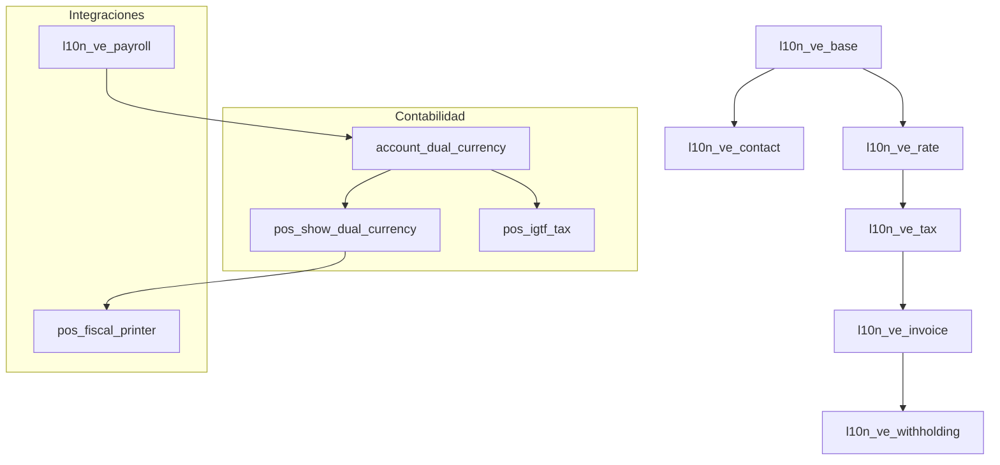

# Manual Maestro: Localización Venezuela Odoo 18 (Técnico y Funcional)

Este documento centraliza toda la información técnica, funcional y de configuración de la localización `LocVe18v2`. Está diseñado para ser la fuente de verdad tanto para desarrolladores como para consultores funcionales.

---
# PARTE I: Arquitectura y Diseño Técnico

## 1. Mapa de Dependencias
La localización sigue una arquitectura modular estricta para garantizar estabilidad y mantenibilidad.

## 2. Flujo de Datos Críticos
### A. Tasa de Cambio (Dual Currency)
1.  **Origen:** `res.currency.rate` (Modelo estándar de Odoo).
2.  **Gestor:** `account_dual_currency` sobrescribe los métodos de conversión (`_convert`) de Odoo para usar siempre la tasa del día de la transacción, no la del sistema.
3.  **Consumo POS:** `pos_show_dual_currency` inyecta la tasa en el inicio de `pos.session` (JS) para que el frontend opere offline con la tasa congelada al momento de abrir caja.
4.  **Consumo Nómina:** `l10n_ve_payroll` usa la tasa en `hr.payslip` (`_create_account_move`) para calcular el valor en Bs de los salarios nominados en divisas.

### B. Cálculo de IGTF (Impuesto a Grandes Transacciones)
El IGTF no es un impuesto estándar de Odoo; es dinámico.
*   **Lógica:** Se activa SOLO si el método de pago tiene el flag `x_is_foreign_exchange`.
*   **Fórmula:** `Monto Pagado ($) * Tasa de Cambio * 3%`.
*   **Registro:** Se crea una línea de factura (o pedido POS) con un producto de servicio llamado "IGTF", que apunta a la cuenta de pasivo configurada.

---
# PARTE II: Guía de Configuración (Admin)

## 1. Pasos Críticos de Instalación
Ver `odoo_sh_installation_guide.md` para el paso a paso en Odoo.sh.
**Regla de Oro:** Instalar primero el núcleo (`l10n_ve_base`, `l10n_ve_invoice`) antes de cualquier módulo de POS o Nómina.

## 2. Configuración Contable
*   **Diarios:** Los diarios de Banco en USD deben tener la moneda configurada explícitamente.
*   **Cuentas de Diferencia:** Es obligatorio configurar cuentas de "Ganancia por Diferencia en Cambio" y "Pérdida por Diferencia en Cambio" en los Ajustes de Contabilidad y en cada Diario en Divisas.

## 3. Configuración POS
*   **Métodos de Pago:** Si crea un método "Zelle":
    *   Marcar `Es Moneda Extranjera`.
    *   Marcar `Aplicar IGTF`.
    *   Asociar el Diario de Banco en USD.

---
# PARTE III: Manual de Usuario (Funcional)

## 1. Operación Diaria POS
1.  **Apertura:** El cajero debe verificar que la tasa mostrada en pantalla coincida con la del BCV del día. Si no, debe contactar al administrador para actualizarla en el backend.
2.  **Cobro Mixto:** El sistema permite pagar una parte en $ (aplica IGTF sobre esta parte) y otra en Bs (no aplica IGTF).
3.  **Cierre de Caja:** El reporte Z mostrará el desglose de lo cobrado en Bs y su equivalente en $ para cuadrar con el efectivo físico.

## 2. Operación de Nómina
1.  **Actualización de Tasa:** Antes de procesar la nómina, asegúrese de que la tasa del día esté cargada.
2.  **Lotes:** Procese las nóminas por lotes (e.g., "Quincena 1 - Empleados Planta").
3.  **Validación de Asientos:** Al confirmar la nómina, verifique el asiento contable generado. Debe estar balanceado en Bs y tener las columnas `Debit USD` y `Credit USD` llenas.

---
# PARTE IV: Solución de Problemas (Troubleshooting)

## 1. Diagnóstico de Errores Comunes

### Error: "No se puede borrar un asiento con retenciones asociadas"
*   **Contexto:** Intentando cancelar una factura de proveedor.
*   **Causa:** La localización crea un objeto `account.wh.iva` vinculado.
*   **Solución:** Primero cancele la Retención en *Contabilidad -> Proveedores -> Retenciones IVA*, luego podrá cancelar la factura.

### Error: "Field 'tax_today' does not exist"
*   **Contexto:** Error 500 al abrir una factura.
*   **Causa:** El módulo `account_dual_currency` no se actualizó correctamente tras una migración.
*   **Solución:** Actualizar el módulo `account_dual_currency` (`-u account_dual_currency`).

### Error POS: IGTF calculado en 0.00
*   **Causa A:** Tasa de cambio = 1.0 (No actualizada).
*   **Causa B:** El producto "IGTF" no tiene precio o impuesto configurado.
*   **Solución:** Verificar tasa y asegurarse que el producto servicio del IGTF tenga precio 0 pero el impuesto del 3% configurado en sus datos maestros.

## 2. Logs y Depuración
Si reporta un error a soporte, incluya:
*   El traceback completo del log de Odoo (`odoo.log`).
*   Captura de pantalla de la configuración del Diario o Impuesto involucrado.
*   Si es POS: Captura de la consola del navegador (F12 -> Console).

---
# PARTE V: Guía para Desarrolladores

## 1. Estándares de Código
*   **Decimales:** Usar siempre `(16, 2)` para montos en Bs y Dólares. Usar `(16, 4)` para tasas de cambio. Evitar `dp.get_precision`.
*   **Vistas:** NO usar `attrs` ni `states`. Usar siempre python domains en `invisible`, `readonly`, `required`.

## 2. Cómo Extender
*   **Nuevos Reportes:** Heredar de `l10n_ve_account_fiscalyear_closing` para reportes legales.
*   **Validaciones POS:** Heredar de `pos_show_dual_currency.models.PosSession` para inyectar nuevos datos al inicio de sesión.

## 3. Repositorio
*   Rama estable: `18.0`.
*   Submódulos: Mantener sincronizados. Al hacer PR, verificar compatibilidad con Odoo Enterprise 18.0.
